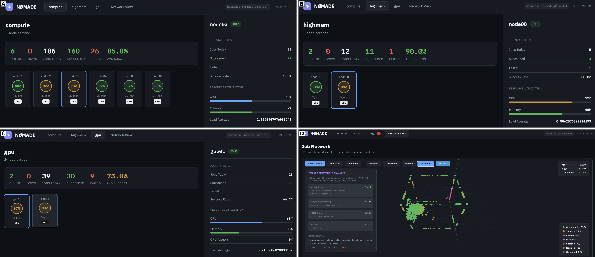

# Summary

NØMADE (NOde MAnagement DEvice) is a lightweight monitoring and predictive analytics tool for High-Performance Computing (HPC) clusters and workstations. It collects system metrics from SLURM-managed environments, stores time-series data in SQLite, and employs machine learning to predict job failures before they occur. The tool provides a real-time web dashboard and supports alerts via email, Slack, or webhooks. NØMADE requires no external databases or complex infrastructure—only Python and standard system tools.

A key innovation is the application of biogeographical network analysis concepts to HPC monitoring. Inspired by methods for identifying transition zones between bioregions [@vilhena2015], NØMADE treats HPC resource domains (compute, storage, network) as interconnected regions where failures cluster at domain boundaries—such as transitions between local scratch and network-attached storage (NAS), or between CPU and GPU workloads. This enables failure pattern recognition that emerges from the data rather than from predefined rules.

# Statement of Need

HPC administrators face a persistent challenge: detecting job failures before they impact researchers. Enterprise monitoring solutions like Prometheus, Grafana, or Nagios require significant infrastructure and target general IT systems rather than HPC-specific workloads. Existing HPC tools such as TACC Stats [@evans2014], XDMoD [@palmer2015], and LLNL's Lightweight Distributed Metric Service [@agelastos2014] provide detailed metrics but require substantial deployment effort and focus on post-hoc analysis rather than real-time prediction.

Common HPC failure patterns include:

- **NFS saturation**: Jobs writing to network storage instead of local scratch
- **Memory leaks**: Gradual consumption leading to out-of-memory kills
- **GPU thermal throttling**: Temperature-induced performance degradation
- **Queue starvation**: Resource contention causing excessive wait times

These failures often exhibit warning signs minutes to hours before critical thresholds are breached. NØMADE addresses this gap by providing:

- **Zero-infrastructure deployment**: Single SQLite database, no external services
- **Real-time prediction**: ML ensemble identifies high-risk jobs before failure
- **Predictive alerts**: Derivative analysis detects accelerating resource consumption
- **Domain-aware analysis**: Recognizes HPC-specific failure patterns at resource boundaries

The tool is suited for small-to-medium HPC centers, research groups managing clusters or workstations, or as a complement to existing monitoring infrastructure.

# Implementation

NØMADE is implemented in Python using scikit-learn [@scikit-learn], PyTorch [@pytorch], and PyTorch Geometric [@pytorch_geometric] for machine learning. It integrates with SLURM [@slurm] for job scheduling data and follows a modular architecture (\autoref{fig:architecture}):

{ width=100% }

{ width=100% }


**Collectors** gather metrics from system tools (`iostat`, `vmstat`, `nvidia-smi`), SLURM commands (`sacct`, `squeue`, `sinfo`), and per-job I/O statistics from `/proc/[pid]/io`. A SLURM prolog hook captures job context at submission time.

**Feature Engineering** transforms raw metrics into a 17-dimensional feature vector per job, including CPU and memory efficiency from `sacct`, NFS write ratios from the job monitor, and system-level indicators (I/O wait, memory pressure, swap activity). These features enable similarity-based analysis across jobs.

**ML Prediction** uses an ensemble of three models:

- Graph Neural Network (GNN): Captures relationships between similar jobs based on cosine similarity of feature vectors
- LSTM: Detects temporal patterns and early warning trajectories
- Autoencoder: Identifies anomalous jobs that deviate from normal behavior

The ensemble outputs a continuous risk score (0–1) rather than binary classification, providing nuanced assessment of job health.

**Alert System** supports both threshold-based alerts (disk usage, GPU temperature) and predictive alerts using derivative analysis. When the rate of change indicates a threshold will be breached, alerts fire before the actual breach occurs. Notifications route through email, Slack, or webhooks with configurable cooldowns to prevent alert fatigue.

# Usage

NØMADE installs via pip and initializes with two commands:
```bash
pip install nomade-hpc
nomade init
nomade collect    # Start data collection
nomade dashboard  # Launch web interface
```

For testing without an HPC cluster:

```bash
nomade demo       # Generate synthetic data and launch dashboard
```

For HPC-wide deployment, system installation configures systemd services and SLURM prolog hooks:
```bash
sudo nomade init --system
sudo systemctl enable --now nomade nomade-learn
```

The dashboard displays real-time cluster health, job risk assessments, and historical trends. Configuration uses TOML files supporting custom thresholds, alert destinations, and collection intervals.

# Acknowledgements

The author thanks George Flanagin for advice and inspiration on HPC system administration, and the University of Richmond's Office of the Provost for financial and resource support.

# References
